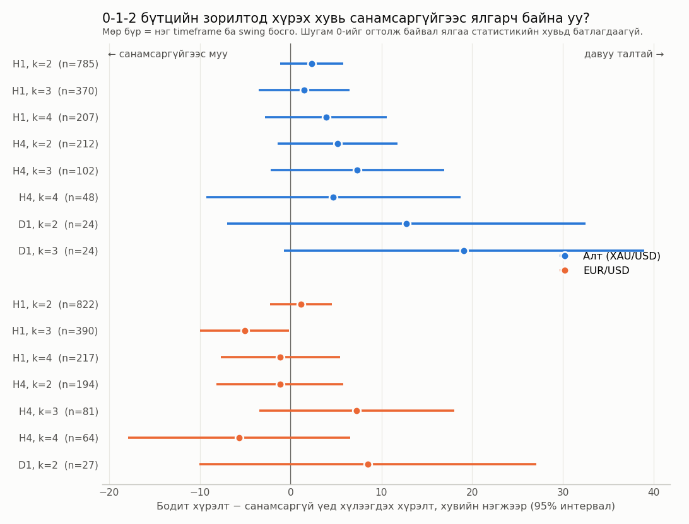
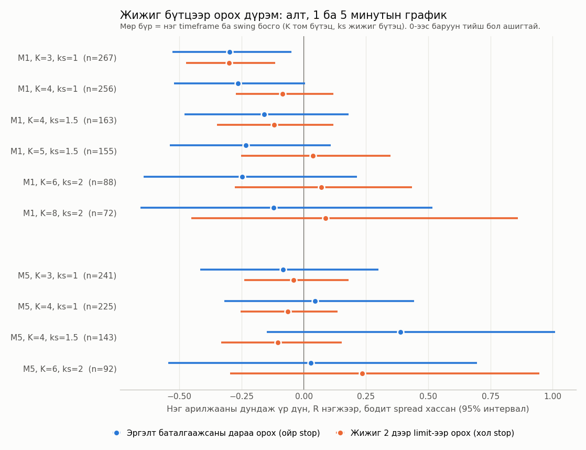

# Does the "0-1-2" measured-move structure predict price?

A statistical test of a chart-structure trading rule on XAU/USD and EUR/USD.
The rule comes from a published trading book; it is restated here in my own words
and no text or figures from the book are included.

**Result: on this data the rule shows no edge over chance, before or after costs.**

## The rule (bullish case; bearish is mirrored)

Four swing points `L0 → H1 → HL → HH` with `HL > L0` and `HH > H1`:

- level 1: `M = (HL + HH) / 2`
- target ("2"): `T = HL + HH − L0`
- after `HH`, a pullback ends at `P`; the trade goes with the main direction and targets `T`

Two entry styles are tested:

1. **Simple** – enter after the pullback low is confirmed, stop beyond the pullback.
2. **Nested** – inside the pullback, wait for a smaller counter-trend 0-1-2 structure
   to complete its own target, then enter (limit at that level, or after a confirmed turn).

## Method

- Swing points come from a causal ATR zigzag: a pivot only exists once price has
  reversed by `k × ATR`, and trades are entered on the *next* bar. No look-ahead.
- Benchmark: for a driftless random walk the chance of reaching the target before the stop
  is `stop distance / (stop distance + target distance)`. The observed hit rate is compared
  with that number, trade by trade.
- Confidence intervals: bootstrap clustered by month (hourly) or by day (intraday).
- Controls: random-time placebo entries with the same direction and stop/target distances,
  and a run on shuffled bars to confirm the code produces no edge on pure noise.
- Costs: hourly tests assume 0.015% (gold) and 0.9 pip (EUR/USD) per round trip;
  intraday tests use the spread recorded on each MT5 bar (median 0.18 USD).

## Results

Hourly bars, 2020-01 to 2026-03, simple entry, `k = 3`:

| Market  | Trades | Hit rate | Chance | Mean result after costs (95% CI) |
|---------|-------:|---------:|-------:|----------------------------------|
| XAU/USD |    370 |    42.8% |  41.3% | 0.00 R (−0.14 … +0.15)           |
| EUR/USD |    390 |    37.9% |  43.0% | −0.14 R (−0.27 … −0.02)          |

The same picture holds on H4 and D1 and for other swing thresholds:



Gold, 1-minute and 5-minute bars, nested entry, real spread:



At the smallest scale (1-minute, `K = 3`, `ks = 1`) the result is significantly negative:
12.7% hits against 17.2% expected by chance, −0.30 R per trade after spread.

Gold longs beat chance and shorts did not, which is the 2020-2026 uptrend rather than the
structure: placebo entries in the same direction did equally well.

## Limitations

- Swing points are defined by an ATR threshold; a discretionary trader picks them by eye.
- The book's "time alignment" component is not tested.
- Intraday history is short (3 months of M1, 17 months of M5), so intervals are wide.
- An edge smaller than about 0.1 R per trade cannot be ruled out with these sample sizes.

## Run it

```
pip install numpy pandas
python ot_analysis.py      # hourly tests  -> results/ot_grid.csv
python ot_nested_run.py    # intraday tests -> results/ot_nested_results.csv
```

Input files go in `data/` (see `data/README.txt`). They are not included in this repository.

| File | Purpose |
|------|---------|
| `ot_backtest.py`   | zigzag, structure detection, simple entry, statistics |
| `ot_analysis.py`   | full hourly grid, model breakdown, placebo |
| `ot_nested.py`     | nested-entry detection with bid/ask spread handling |
| `ot_nested_run.py` | intraday grid on M1 and M5 |
